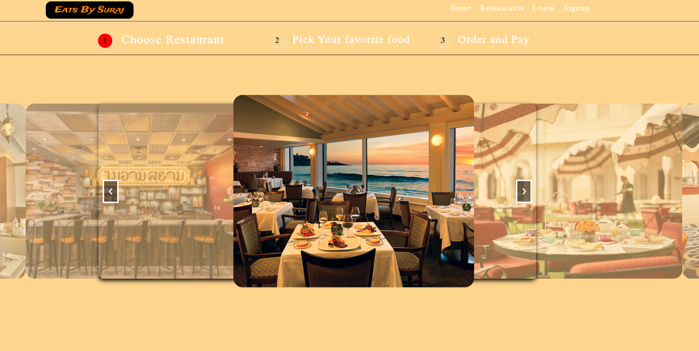
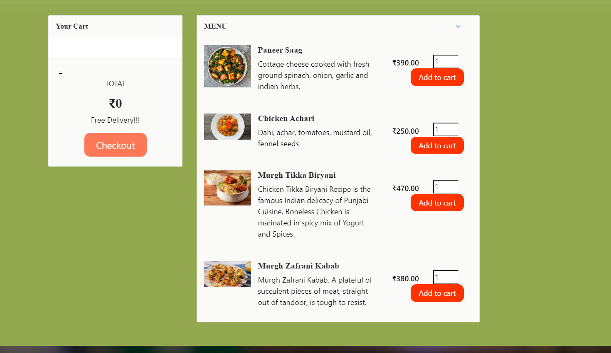
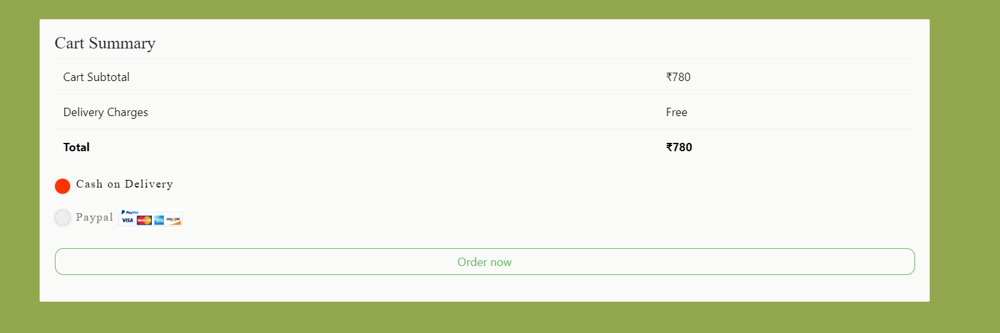
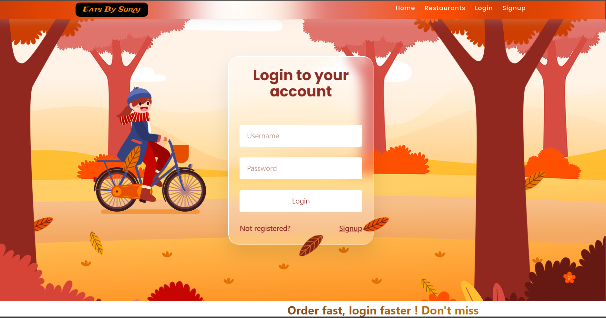
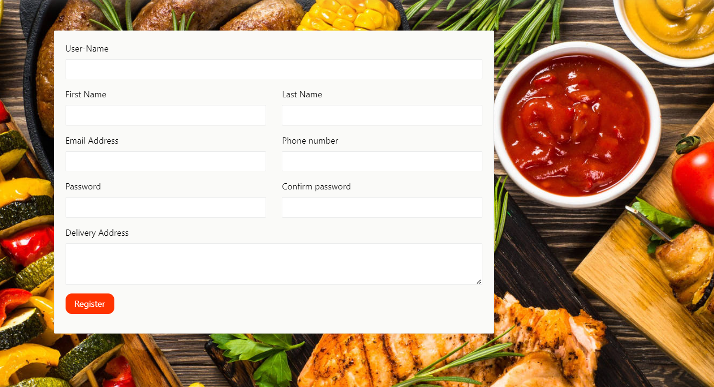
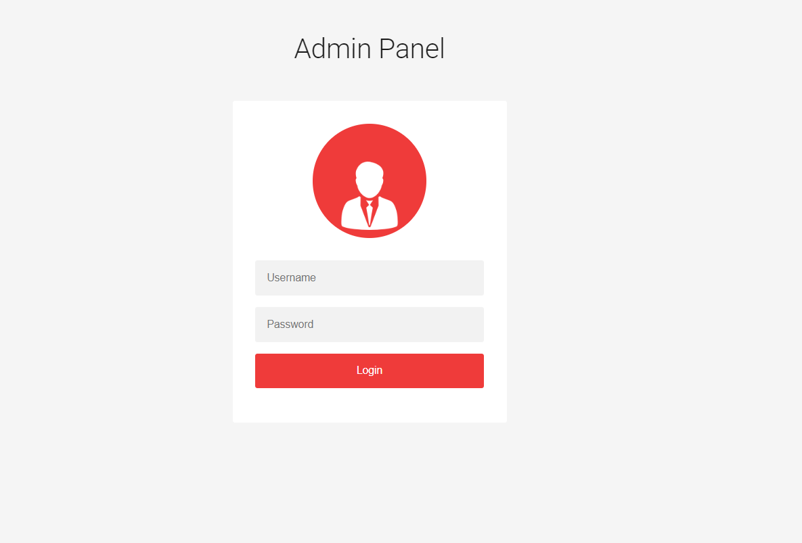
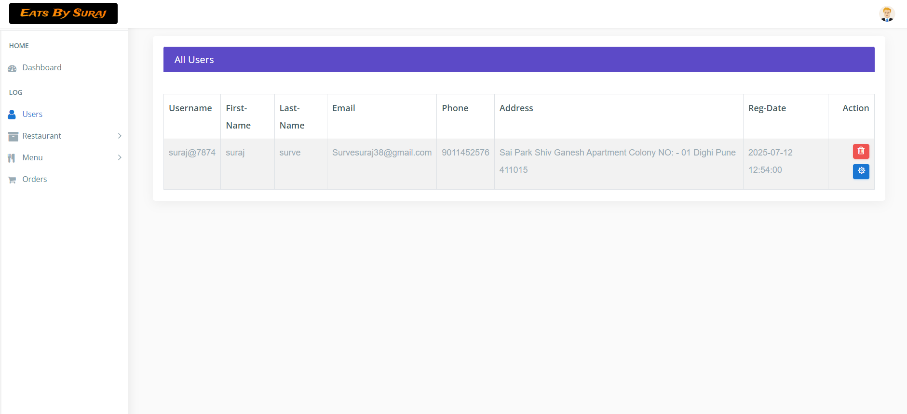
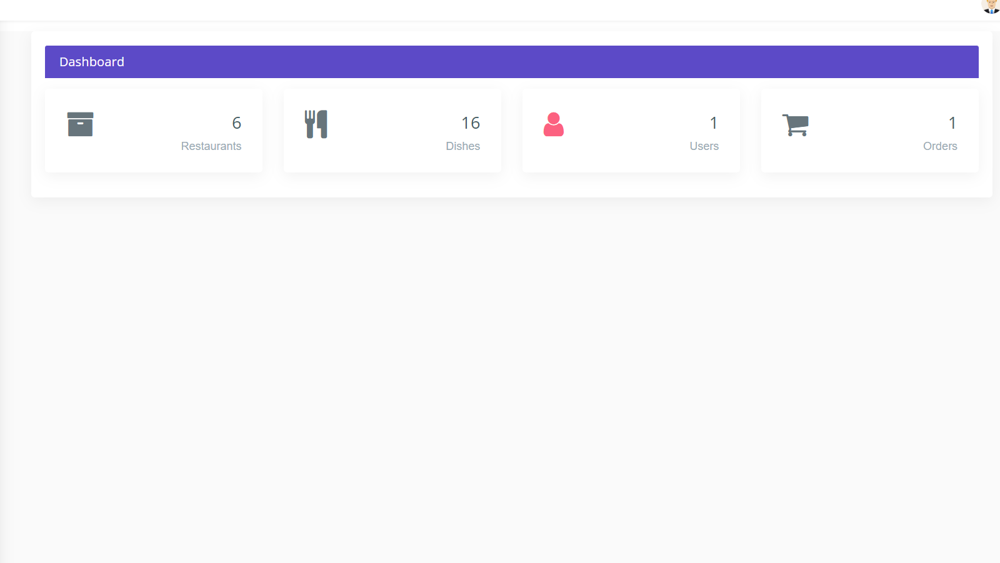
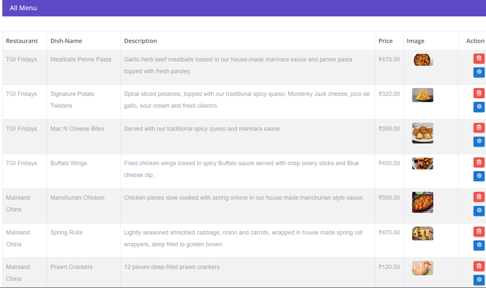

# 🍽️ Restaurant and Menu Management System

A responsive web-based application that allows users to browse restaurants, view their menus, add dishes to a cart, and place orders. The system supports user registration, login, and cash-on-delivery payment.

---

## 🔑 Features

- 👤 User Registration & Login
- 🏪 Browse Restaurants and Menus
- 🛒 Add Dishes to Cart
- 💵 Place Orders (Cash on Delivery)
- 🔐 Session-based Authentication
- 📱 Mobile-Friendly Responsive Design

---

## 🛠️ Technologies Used

- **Frontend:** HTML, CSS, JavaScript, jQuery, Ajax  
- **Backend:** PHP  
- **Database:** MySQL

---

## 📁 Project Structure

| File/Folder         | Description                          |
|---------------------|--------------------------------------|
| `index.php`         | Homepage displaying all restaurants  |
| `restaurant.php`    | Menu of a selected restaurant        |
| `registration.php`  | New user registration form           |
| `login.php`         | User login page                      |
| `cart.php`          | Manage cart items                    |
| `checkout.php`      | Confirm and place the order          |
| `admin/`            | Admin-side management pages (optional) |

---

## 🗄️ Database Overview

Database Name: `restaurantdb`

### 📦 Main Tables:
- `users` – Stores user details  
- `restaurants` – List of restaurants  
- `menus` – Dishes and pricing  
- `orders` – Customer orders and status

---

## 🚀 How to Run the Project

1. 📥 Clone or download the repository.
2. 🛢️ Import the provided SQL file into MySQL (phpMyAdmin).
3. ⚙️ Update database credentials in your PHP files (usually in `db.php` or similar).
4. 🌐 Run the project on a local server like **XAMPP**, **WAMP**, or **LAMP**.
5. 🖥️ Visit `http://localhost/RESTAURANT/index.php` in your browser.

---

## 🌟 Future Enhancements

- 🛣️ Add **Order Tracking**
- 💳 Integrate Online Payment (Razorpay/Stripe)
- 🧑‍💼 Add Admin Panel for Restaurant & Menu Management

---

## 🖼️ Screenshots

| Page | Preview |
|------|---------|
| Main Page |  |
| Restaurant View |  |
| Dish Page |  |
| Cart Page |  |
| Checkout Page |  |
| Order Confirmation |  |
| Login Page |  |
| Register Page |  |
| Order Details |  |
| Admin Login |  |
| Admin Dashboard |  |
| All Orders Info |  |
| Add Menu |  |
| Add Restaurant |  |
| Footer |  |

---

## 👨‍💻 Author

**Suraj**  
📧 Email: [survesuraj38@gmail.com](mailto:survesuraj38@gmail.com)

---

## 🔐 Admin Panel Access

- **Username:** `suraj`  
- **Password:** `suraj123`  

> ⚠️ If you face any issues, feel free to contact me via email!

---

