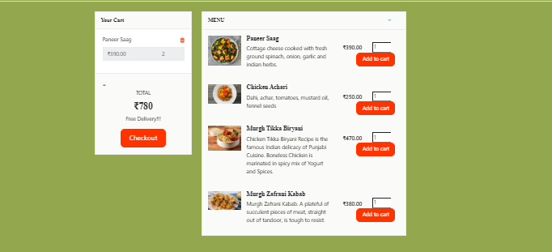

# Restaurant and Menu Management System

This project is a web-based application that allows users to browse restaurants, view their menus, add dishes to a cart, and place orders. It supports user registration, login, and cash on delivery payment mode.

## Features

- User Registration and Login
- View Restaurants and their Menus
- Add Dishes to Cart
- Place Orders (Cash on Delivery)
- Basic Authentication and Session Management
- Responsive Design (Mobile Friendly)

## Technologies Used

- HTML
- CSS
- JavaScript
- jQuery
- Ajax
- PHP
- MySQL

## Project Structure

- `index.php` – Homepage displaying restaurants
- `restaurant.php` – Menu of selected restaurant
- `registration.php` – New user registration
- `login.php` – User login
- `cart.php` – View and manage cart items
- `checkout.php` – Confirm and place the order
- `admin/` – Admin side pages (if any)

## Database

- MySQL database named `restaurantdb` (or your chosen name)
- Main tables:
  - `users` (user details)
  - `restaurants` (restaurant details)
  - `menus` (menu items)
  - `orders` (user orders)

## How to Run

1. Clone or download this repository.
2. Import the SQL database into your MySQL server.
3. Configure your database connection in the project files.
4. Run the project on a local server (XAMPP/WAMP/LAMP).
5. Access the homepage via `http://localhost/RESTAURANT/index.php`.

## Future Improvements

- Add Order Tracking Feature
- Integrate Online Payment Gateways
- Add Admin Panel for managing restaurants and menus

- Images :-
-

## Author

- Suraj

##admin panel username and password :-
username :-suraj
password :-suraj123

#if you get problem dm me on email :
survesuraj38@gmail.com

